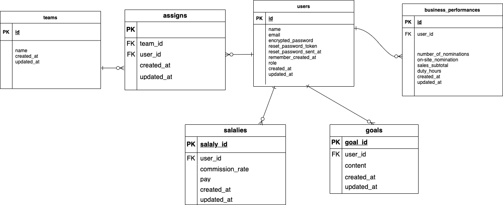

# README

# 開発言語
* Ruby3.0.1
* Rails6.1.7
<br>

# 就職Termの技術
* AWS EC2
* devise
* cancancan
<br>

# カリキュラム外の技術
* line-bot-api
* gem chartkick
<br>

# 実行手順
```
$ git clone git@github.com:monn1997/original_application.git
$ cd original_application
$ bundle install
$ yarn install
$ rails db:create && rails db:migrate
$ rails s
```
<br>

# カタログ設計
https://docs.google.com/spreadsheets/d/1xnWG0MWhm2Vl4R2LohBOAwwNg9ZrBhEEWcOh-ATdUDk/edit?pli=1#gid=1875242024
<br>

# テーブル定義書
https://docs.google.com/spreadsheets/d/1xnWG0MWhm2Vl4R2LohBOAwwNg9ZrBhEEWcOh-ATdUDk/edit?pli=1#gid=2131477942
<br>

# 画面遷移図

<br>

# ER図

<br>

# ワイヤーフレーム

<br>

